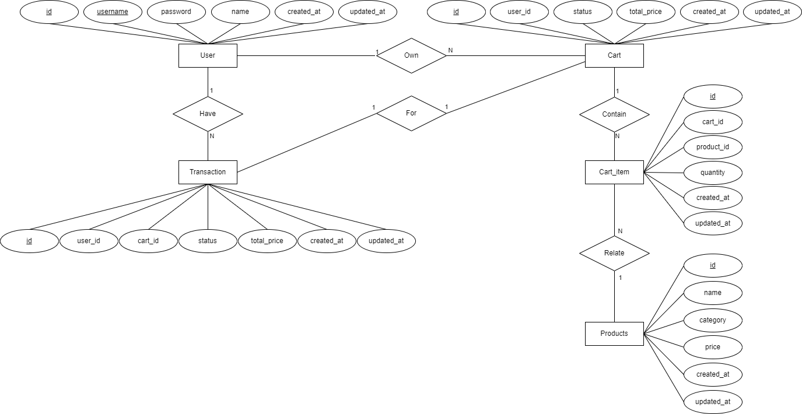

# RESTAPI Documentation

Full URLs are provided in responses they will be rendered as if service
is running on 'http://localhost:8080/'.

## Open Endpoints

Open endpoints require no Authentication.

* [Register](docs/register.md) : `POST /api/v1/register`
* [Login](docs/login.md) : `POST /api/v1/login`

## Endpoints that require Authentication

Closed endpoints require a valid Token to be included in the header of the
request. A Token can be acquired from the Register or Login Endpoints above.

### Products Related

Endpoints for viewing products that the Authenticated User has permissions to access.

* [Get all products ](docs/products/get.md) : `GET /api/v1/products/`
* [Get products by category](docs/products/category.md) : `GET /api/v1/products/?category=`

### Carts Related

Endpoints for viewing carts and manipulating item within the cart that the Authenticated User has permissions to access.

* [Get cart items in cart](docs/products/get.md) : `GET /api/v1/cart`
* [Add item to cart](docs/carts/add.md) : `POST /api/v1/cart/add`
* [Remove item from cart](docs/carts/delete.md) : `Delete /api/v1/cart/delete`

# ER Diagrams

